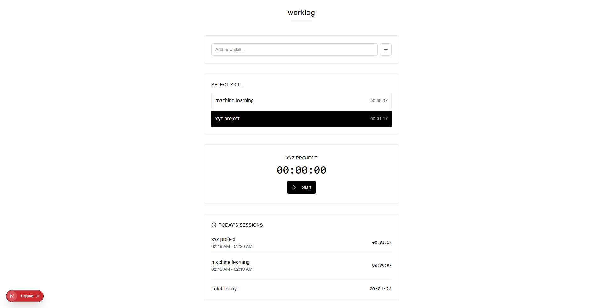

# worklog

a super minimal, no-bs app to track how much time you spend working.

## what it does

- start a timer for any task or skill  
- stop it when you're done  
- see how much time you’ve logged  
- stores all data in local storage
- that’s it
